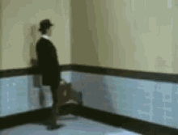
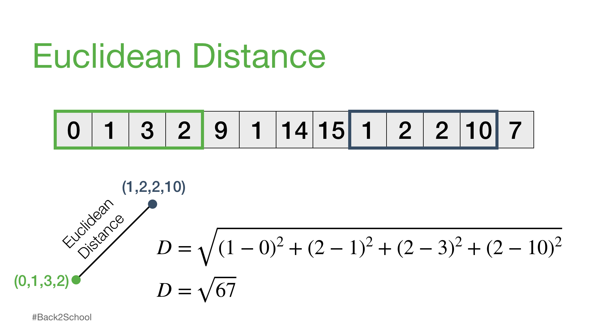
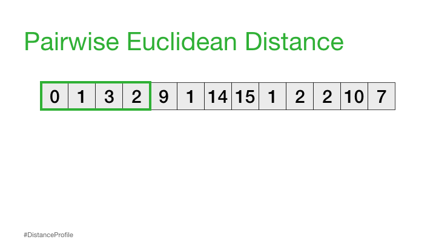
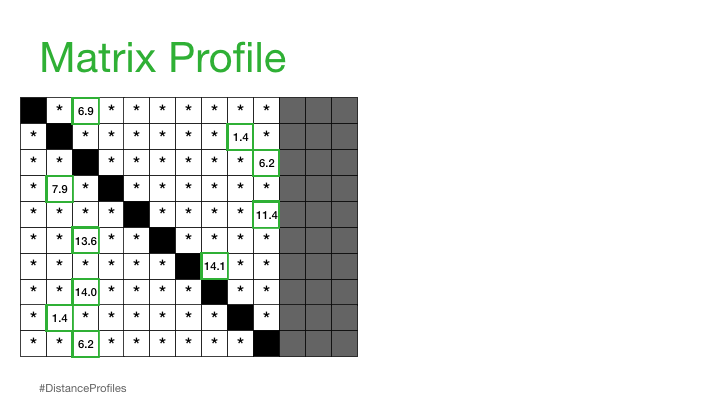
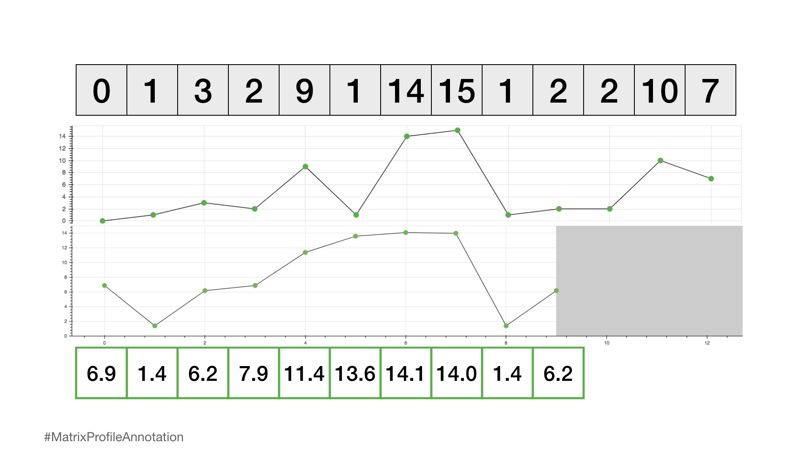
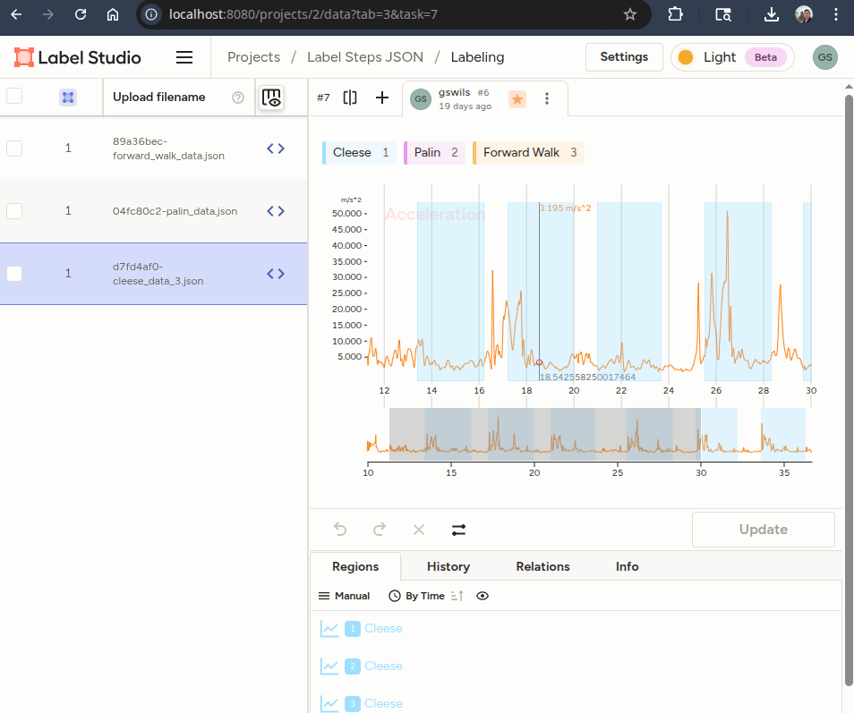
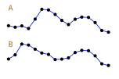
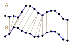
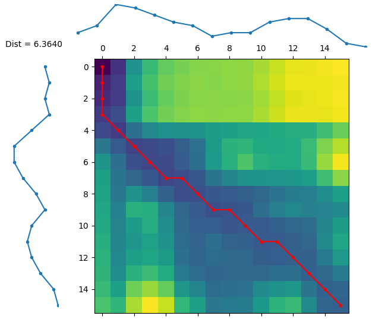

# Data Science in Motion

Some ML and non-ML Techniques for IoT Time-Series Analysis

Greg Wilson <a href="https://github.com/gregwdata" class="ns-c-iconlink"><mdi-github-circle/></a> <a href="https://www.linkedin.com/in/greg-wilson-6212572/" class="ns-c-iconlink"><mdi-linkedin-box/></a>  

<div style="float: right;">
<QRCode value="https://github.com/gregwdata/Cincinnati_ML_meetup_2025_09_22" :size="200" render-as="svg" />
Code Repository
</div>

<!--
The last comment block of each slide will be treated as slide notes. It will be visible and editable in Presenter Mode along with the slide. [Read more in the docs](https://sli.dev/guide/syntax.html#notes)
-->

---
layout: two-cols-title
---

::title::
# About Me
Twisty Path to Data Science

::left::
### Education

* <div style="display: inline-flex; align-items: end;">
      <div v-mark.highlight="{ at: [1,2], color: 'goldenrod'}" >
      BS AAE &amp; MS AAE ('06 &amp; '07)
    </div></div >
* <div style="display: inline-flex; align-items: end;"><div v-mark.highlight="{at: [3,4], color: 'goldenrod'}">PhD Aerospace Engineering 2013</div></div>
### Work
* Alcoa
* <div v-mark.highlight="{at: [5,6], color: 'goldenrod'}">GE Aerospace</div>
* <div v-mark.highlight="{at: [7], color: 'goldenrod'}">Precision Castparts Corp</div>

::right::

## Skills Developed... 
<div v-click="1">* Programming (Matlab, C, Fortran)</div>
<v-click at="1"><div>* Fracture Mechanics & Composite Mechanics</div></v-click>
<v-click at="1"><div>* Optimization / design philosophy</div></v-click>
<div v-click="3">* Linkage between mechanics, simulation, and experiment</div>
<div v-click="5" style="font-weight: bold;">* Corporate IT bureaucracy & digital projects </div>
<div v-click="5">* Programming (R, Python, SQL) </div>
<div v-click="5">* Data Infra (Postgres, Dataiku, Docker)</div>
<div v-click="5">* Stats / Data Science / 6σ </div>
<div v-click="5">* Computer Vision </div>

<div v-click="7" style="font-weight: bold;">* Aligning to the speed of the business</div>
<div v-click="7">* Finding dotted line paths</div>
<div v-click="7">* Enterprise Data architecture / cloud</div>
<div v-click="7" style="font-weight: bold;">* Operations Research</div>
<div v-click="7">* Generative AI applications</div>

<style>
.highlight-on-click.slidev-vclick-target {
  color: white;
  font-weight: 900;
}

.highlight-on-click {
  opacity: 1 !important; /* always visible */
}
</style>

---
layout: two-cols-title
columns: is-7 
---

::title::
# Sensor Data

::left::
## There are lots of sensors here

<style>
.small-table {
  font-size: 0.65em;
  width: 75%;
  border-collapse: collapse;
  margin-left: auto;
  margin-right: auto;
}
.small-table th, .small-table td {
  padding: 0.1em 0.2em;
  border: 1px solid #ccc;
  text-align: left;
}
.small-table tr:nth-child(even) {
  background-color: #222831;
}
.small-table tr:nth-child(odd) {
  background-color: #393e46;
}
.small-table th {
  background-color: #00adb5;
  color: #fff;
}
</style>

<table class="small-table">
  <thead>
    <tr>
      <th>Timestamp</th>
      <th>Tag Name</th>
      <th>Value</th>
    </tr>
  </thead>
  <tbody>
    <tr>
      <td>2025-06-01 08:04:21</td>
      <td>press.oil_temp</td>
      <td>78.2</td>
    </tr>
    <tr>
      <td>2025-06-01 08:04:21</td>
      <td>press.temperature</td>
      <td>120.5</td>
    </tr>
    <tr>
      <td>2025-06-01 08:04:23</td>
      <td>press.force</td>
      <td>15.3</td>
    </tr>
    <tr>
      <td>2025-06-01 08:04:27</td>
      <td>press.oil_temp</td>
      <td>78.4</td>
    </tr>
    <tr>
      <td>2025-06-01 08:04:31</td>
      <td>press.temperature</td>
      <td>120.7</td>
    </tr>
    <tr>
      <td>2025-06-01 08:04:31</td>
      <td>press.force</td>
      <td>15.2</td>
    </tr>
  </tbody>
</table>

::right::
<v-click> 
<h2>And also here!</h2>
<br>


We'll use sensors on a cell phone to demonstrate some time series data analysis methods
</v-click>

---
layout: image-left
image: ./images/Phone_in_mount_attached_to_a_spring.jpeg

class: phyphoxslide
---

<style>
/* General sibling: any .w-full that’s a sibling after a .w-4/5 */
.w-full:has([class~="phyphoxslide"]) { width:80% !important; }
</style>


<div style="width:150%">
<h1>phyphox</h1>


Project of **RWTH Aachen University** to make sensors on phones and tablets accessible for education and expermentation

Direct access to your device's sensors, with scientific post-processing and visualization

E.G. Spectrogram of audio recorded on the microphone

Remote usage with web UI and REST API

</div>


<div style="position: absolute; bottom: 1em; right: 4em; font-size: 0.65em; color: #aaa;">
  <span style="font-size:1.2em;">&#8592;</span> photo credit <a href="https://phyphox.org/wiki/index.php/File:Phone_in_mount_attached_to_a_spring.jpeg" style="color: #aaa;">https://phyphox.org/wiki/index.php/File:Phone_in_mount_attached_to_a_spring.jpeg</a>
</div>

---
layout: two-cols-title
columns: is-8-4
align: c-lt-lt
---

::title::
# phyphox REST API call

::left::

```py {*|3|4-6|4-6|all}{class:'w-100% !children:text-0.8em'}
import requests

PHONE_URL = 'http://192.168.50.57'
PP_CHANNELS = ["accX", "accY", "accZ","acc","acc_time"]

url = PHONE_URL + "/get?" + ("&".join(PP_CHANNELS))
data = requests.get(url=url).json()
print(data)
```

<div v-click=4>
```json {*}{class:'w-100% !children:text-0.8em'} 
{
  'status': 
  {'countDown': 0, 'session': '5922432', 'measuring': True, 'timedRun': False}, 
  'buffer': 
  {
    'accZ': {'updateMode': 'single', 'size': 0, 'buffer': [0.0278853714466095]}, 
    'accY': {'updateMode': 'single', 'buffer': [-0.0022519089281558993], 'size': 0}, 
    'acc': {'size': 0, 'updateMode': 'single', 'buffer': [0.03235740484655496]}, 
    'accX': {'size': 0, 'updateMode': 'single', 'buffer': [-0.016258432085160167]}, 
    'acc_time': {'buffer': [1284.2399981666822], 'updateMode': 'single', 'size': 0}
  }
}
```
</div>

::right::
<v-click at="1">
The Phone's IP address - phyphox will display it
<Arrow x1="620" y1="100" x2="360" y2="140" /> 
</v-click>

<v-click at="2">
The form and parameters of the API call can be found in the docs...
<Arrow x1="620" y1="160" x2="500" y2="195" />
<Arrow x1="620" y1="160" x2="530" y2="165" />
</v-click>
<v-click at="3">
...or by checking `developer tools` in your broswer!
</v-click>


---
layout: two-cols-title
columns: is-8-4
align: c-lt-lt
---

::title::
# Streaming data - or "calling the API in a loop"

::left::

```py {*|8,13|10,11,12}{class:'w-100% !children:text-0.8em'}
import requests
import time

PHONE_URL = 'http://192.168.50.57'
PP_CHANNELS = ["accX", "accY", "accZ","acc","acc_time"]

url = PHONE_URL + "/get?" + ("&".join(PP_CHANNELS))
while True:
    data = requests.get(url=url).json()
    output = ' | '.join([f'{tag} : {value['buffer'][0]:-4.5f}' 
                for tag, value in data['buffer'].items()])
    print(output)
    time.sleep(0.1)
```

<div v-click=2>
``` {*}{class:'w-100% !children:text-0.8em'} 
accZ : 0.03664 | accY : -0.01135 | acc : 0.03950 | accX : 0.00941 | acc_time : 1226.48056
accZ : 0.01778 | accY : -0.01529 | acc : 0.02357 | accX : 0.00236 | acc_time : 1226.68209
accZ : 0.03395 | accY : 0.01028 | acc : 0.03600 | accX : -0.00617 | acc_time : 1226.79294
accZ : 0.02826 | accY : -0.01079 | acc : 0.03074 | accX : 0.00549 | acc_time : 1226.90378
accZ : 0.03320 | accY : -0.00094 | acc : 0.03408 | accX : 0.00767 | acc_time : 1227.02470
accZ : 0.03949 | accY : -0.00257 | acc : 0.03965 | accX : -0.00253 | acc_time : 1227.13554
accZ : 0.02332 | accY : 0.00030 | acc : 0.02463 | accX : -0.00789 | acc_time : 1227.25646
accZ : 0.02602 | accY : -0.00568 | acc : 0.02713 | accX : 0.00520 | acc_time : 1227.36730
...
```
</div>

::right::
Keep calling the API - keep getting data...

<v-click at="3">
... but what if we want to be sure we get *all* the data?
</v-click>


---
layout: two-cols-title
columns: is-9-3
align: c-lt-lt
---

::title::
# Decoupling Sensor Readings from Measurement Times

::left::

```py {*|7,9,10,23|12,13,26,27,28}{class:'w-100% !children:text-0.75em !children:leading-14px '}
import requests, time, os

PHONE_URL = 'http://' + os.getenv('PHYPHOX_ADDRESS')
PP_CHANNELS = ["accX", "accY", "accZ","acc","acc_time"]
TIME_CHANNEL = "acc_time"  # monotonic channel for thresholding

last_update_time = 0 # initialize to a low value
while True:
    url = PHONE_URL + "/get?" + ("&".join([c + '=' + str(last_update_time) 
        + '|' + TIME_CHANNEL for c in PP_CHANNELS]))
    data = requests.get(url=url).json()
    data_buffer = data['buffer']
    xyz_data = [data_buffer[tag]['buffer'] for tag in PP_CHANNELS]
    timestamp = time.time()
    exp_time = data_buffer[TIME_CHANNEL]['buffer']

    if len(exp_time) > 0: 
        # Truncate to shortest result in case tags have differing length
        shortest_len = min([len(x) for x in xyz_data]) 
        xyz_data = [x[:shortest_len] for x in xyz_data]
        exp_time = exp_time[:shortest_len]
        # update the time threshold for next request
        last_update_time = exp_time[-1] 

        print(f'--------\nAt time {last_update_time}')
        for i,tag in enumerate(PP_CHANNELS):
            print(f'---\n{tag}:')
            print(xyz_data[i])
```

::right::
The phyphox API takes a `<tagA>=<value>|<tagB>` parameter to threshold data from tag A based on value of tag B

<v-click at="3">
<div style="width:120%; margin-left:0%;">
  
</div>
</v-click>
<br>
<v-click at="4">
Now that we have our data acquisition system in place, it's time to do something useful with it
</v-click>


---
layout: two-cols-title
columns: is-8-4
align: c-lt-lt
---

::title::
# Plotting

::left::

```python {all|6-9|16-20|13,22|all}
import matplotlib.pyplot as plt
from matplotlib.animation import FuncAnimation

history = {ch: [] for ch in PP_CHANNELS}
fig, ax = plt.subplots()
lines = {}
for ch in PP_CHANNELS[:-1]:  # Don't plot time channel
    (line,) = ax.plot([], [], label=ch)
    lines[ch] = line

... API calls ...

def animate(frame):
    fetch_data() # API call, updates history and trims to last 10 seconds
    t = history[TIME_CHANNEL]
    for ch in PP_CHANNELS[:-1]:
        lines[ch].set_data(t, history[ch])
    ax.relim()
    ax.autoscale_view(scalex=True, scaley=True)
    return lines.values()

ani = FuncAnimation(fig, animate, interval=0, blit=False)
plt.show()
```

::right::
* The `FuncAnimation` method in `matplotlib.pyplot` lets us redraw artists by repeatedly calling a function

---
layout: two-cols-title
columns: is-6-6
align: c-lt-lt
---

::title::
# Plotting (fastplotlib)

::left::

```python {all|12-14|22|all}
...
import fastplotlib as fpl
...
def plot_data():

    x_data = [[] for _ in PP_CHANNELS]
    y_data = [[] for _ in PP_CHANNELS]

    # Figure of shape 2 x 3 with all controllers synced
    figure = fpl.Figure(shape=(4, 1), size=(700, 560))    

    x_data = [[0.0]*MAX_BUFFER_SIZE for _ in PP_CHANNELS]
    y_data = [[0.0]*MAX_BUFFER_SIZE for _ in PP_CHANNELS]
    z_data = [[0.0]*MAX_BUFFER_SIZE for _ in PP_CHANNELS] # fastplotlib requires all data to be (N,3)

    # Make a placeholder image graphic for each subplot
    lines = []
    for i,subplot in enumerate(figure):
        # create image data
        # Create initial empty line with NaN values
        initial_data = np.column_stack((np.array([0]*MAX_BUFFER_SIZE), np.array([0]*MAX_BUFFER_SIZE)))
        line = subplot.add_line(initial_data, colors='blue', name="line")
        lines.append(line)
        subplot.title = PP_CHANNELS[i]
```
::right::
<div class="relative h-full">
  <!-- Bullets are visible initially -->
  <ul class="pr-2">
    <li><code>fastplotlib</code> renders via GPU and is designed to be fast</li>
    <li>It's less mature, and has a bit of a learning curve</li>
    <li>Plotting animations
      <ul>
        <li>it expects to overwrite the data that it is initialized with</li>
        <li>so data has to have the same shape</li>
      </ul>
    </li>
  </ul>

  <!-- This code block is hidden initially and appears over the bullets -->
  <div
    v-click
    class="absolute inset-x-0 top-0 z-10 max-h-[150%] overflow-auto rounded-lg shadow-lg"
    style="background: var(--slidev-code-background, rgba(0,0,0,0.9));"
  >
```python
# Define a function to update the image graphics with new data
def update_data():
    while not data_queue.empty():
        with lock:
            timestamp, xyz_data, times = data_queue.get()
            for i, value in enumerate(xyz_data):
                x_data[i].extend(times)
                y_data[i].extend(value)

        for i,subplot in enumerate(figure):
            new_data = np.empty((MAX_BUFFER_SIZE, 3),np.float32)
            new_data[:,0] = np.array(x_data[i][-MAX_BUFFER_SIZE:])
            new_data[:,1] = np.array(y_data[i][-MAX_BUFFER_SIZE:])
            new_data[:,2] = np.array(z_data[i][-MAX_BUFFER_SIZE:])
            # index the image graphic by name and set the data
            subplot["line"].data = new_data 
            subplot.auto_scale(maintain_aspect=False)

# add the animation function
figure.add_animations(update_data)

# show the figure
figure.show()
```
  </div>
</div>


---
layout: image-left
class: sillywalks
---

<style>
/* General sibling: any .w-full that’s a sibling after a .w-4/5 */
.w-full:has([class~="sillywalks"]) { width:80% !important; }
</style>




<div style="width: 500px">
<h1>The Analytics Department at the Ministry of Silly Walks</h1>


With our accelerometer data, we will:
* Record data during a walk
* Use the *matrix profile* technique with the `stumpy` library to identify repeated patterns (steps) in the data and isolate them
* Use `labelstud.io` to manually curate the step instances
* Use *Dynamic Time Warping* with the `dtaidistance` library to classify a new step as a `Cleese` or `Palin`
* Expand our usage of DTW to label the segments of a step


</div>

---
layout: two-cols-title
columns: is-6-6
align: l-lt-lt
---

::title::
# Matrix Profile with stumpy

::left::
### Subsequence comparison

<ul>
  <v-click at="1"><li>Subsequence: Finite-length sequence of values</li></v-click>
  <v-click at="2"><li>How to compare subsequences?</li></v-click>
  <v-click at="4"><li>If they have the same length, Euclidian distance</li></v-click>
</ul>

### Distance Profile

<ul>
  <v-click at="6"><li>Slide 1 "query" subsequence along the entire sequence. Calculate distance at every step</li></v-click>
  <v-click at="8"><li>The lowest distance (apart from the trivial self-match) is the closest matching subsequnece</li></v-click>
  <v-click at="4"><li>If they have the same length, Euclidian distance</li></v-click>
</ul>

::right::

<div style="position: relative; width: 110%; margin-left: 0%;">
  <!-- First image -->
  <div v-click="[3,5]" style="position: absolute; top: 0; left: 0; width: 100%;">
    
  </div>

  <!-- Second image -->
  <div v-click="[5,7]" style="position: absolute; top: 0; left: 0; width: 100%;">
    
  </div>

  <div v-click="7" style="position: absolute; top: 0; left: 0; width: 100%;">
    
  </div>
  <div v-click="3" style="position: relative; top: 260px">
    <p>Graphics from Stumpy docs</p>
  </div>
</div>


---
layout: two-cols-title
columns: is-6-6
align: l-lt-lt
---

::title::
# Matrix Profile with stumpy

::left::
### Matrix Profile

- Now do that for *all* query sequences of length *n*
- Take the nearest neighbor (lowest distance) of each query sequence
- This is the matrix profile

### In Code
```python
import stumpy
data = [0.,1.,3.,2.,9.,1.,14.,15.,1.,2.,2.,10.,7.]
window = 4
mp = stumpy.stump(data, window, normalize=False)
print(', '.join(f'{d:.2f}' for d in mp[:,0]))
# 6.86, 1.41, 6.16, 7.94, 11.40, 13.56, 18.00, 13.96, 1.41, 6.16
```


::right::

<div style="position: relative; width: 110%; margin-left: 10%;">
  <!-- First image -->
  <div  style="position: absolute; top: 0; left: 0; width: 80%;">
    
  </div>

  <!-- Second image -->
  <div style="position: absolute; top: 225px; left: 0; width: 80%;">
    
  </div>
  <!--<p>Graphics from `Stumpy` docs</p>-->
</div>

---
layout: top-title
titlewidth: is-2
align: lm
---

:: title ::
# Finding Motifs

:: content ::
### Motifs

- A repeated pattern is a "Motif"
- In the Matrix Profile, low distance values suggest possible motifs
- We are interested in repeating similar sequences (steps!)
- Let's go to a notebook and use `stumpy` to find motifs in our recorded accelerometer data

---
layout: two-cols-title
columns: is-6-6
align: l-lt-lt
---
:: title ::
# Label Studio

:: left ::
<div style="width:100%;">
  
  
</div>


:: right ::
- We auto-labeled some steps with stumpy. What if we want to adjust them?
- `labelstud.io` is an open-source data labeling platform
  - It runs locally, via browser UI
  - Covers multiple modalities: image, audio, time series, text...
- Install with `pip install -U label-studio`
- Then run with `label-studio`
- Or run without install via `uvx label-studio`

---
layout: two-cols-title
columns: is-6-6
align: l-lt-lt
---
:: title ::
# dynamic time warping

:: left ::
### Compare (sub-) sequences that are similar with different timing
- Each step of the same type will have a slightly different duration
- How to quanitfy that these two sequences are "close"?
- Dynamic Time Warping (DTW) is a technique to quantify how close they are
- Align the point in **A** to the best matching point in **B**
- Constraint that points stay in order

:: right ::


<div style="position: relative; width: 110%; margin-left: 10%;">
  <!-- First image -->
  <div v-click.hide="1" style="display:inline-block; position: absolute; top: 0; left: 0; width: 80%; background-color: white">
    
  </div>

  <!-- Second image -->
  <div v-click="1" style="display:inline-block; position: absolute; top: 0; left: 0; width: 80%; background-color: white">
    
  </div>

</div>
<br><br><br><br>
<br><br><br><br>
<br><br>

$$
\begin{array}{l}
D(0,0) = 0 \\[4pt]
D(i,0) = D(0,j) = +\infty \\[4pt]
D(i,j) = d(i,j) +
  \min \left\{
    \begin{array}{l}
      D(i-1, j-1) \\[2pt]
      D(i-1, j) + \omega   \\[2pt]
      D(i,   j-1) + \omega
    \end{array}
  \right.
\end{array}
$$


---
layout: two-cols-title
columns: is-6-6
align: l-lt-lt
---
:: title ::
# dynamic time warping

:: left ::
- Several Python libraries exist for DTW
- I recommend `dtaidistance` for its speed
  - `_fast` implementation of each method uses compiled C code and runs in parallel
  - good default - check other libaries for have specific needs of your use case

```py
from dtaidistance import dtw
from dtaidistance import dtw_visualisation as dtwvis
import numpy as np
import matplotlib.pyplot as plt
A = np.array([3, 2, 3, 2, 6, 10, 10, 8, 5, 3, 6, 7, 6, 4, 1, 0], dtype=float)
B = np.array([4, 6, 12, 11, 9, 7, 6, 3, 4, 4, 7, 8, 8, 5, 1, 0], dtype=float)
d, paths = dtw.warping_paths(A, B, penalty=1.5, psi=0)
best_path = dtw.best_path(paths)
dtwvis.plot_warpingpaths(A, B, paths, best_path)
plt.show()
```

:: right ::



<v-click at="1">
<box 
  left="470px"
  top="80px" 
  width="120px" 
  height="85px"
  borderColor="#ff44a2ff"
  borderWidth="2px" 
  borderStyle="solid"
  backgroundColor="#00000000" 
  textColor="#ff44a2ff" 
  title="Distance" 
  description="                " 
  />
</v-click>

---
layout: two-cols-title
columns: is-11-1
align: l-lt-lt
---
:: title ::
# K-Nearest Neighbors Classification

:: left :: 

### If I can calculate a distance between two things...
- I can calculate the distance between 1 new thing and lots of reference things
- If I have labeled the references, I can classify the new one by the label of its "Nearest Neighbor"
- **Nearest Neighbor:** the reference item with the lowest distance
- To make a more robust classifier, you can choose some number, `K`, of the closest neighbors to base your classification on
  - Voting
  - Proportion
  - Poison apple
  - etc.

:: right ::

---
layout: two-cols-title
columns: is-6-6
align: l-lt-lt
---
:: title ::
# Putting it all together

:: left :: 

### Complete example
- Live updates from REST API
- Run DTW against reference sequences and flag Nearest Neighbor
- Plot the live data, and color subsequences as DTW classifies


:: right ::
### Tricky bits
- `multiprocess` module allows DTW to run on its own and not block the plotting of live data
  - Nested `multiprocess` was the cleanest way to parallelize the subsequence search method
- Queues used to exchange data between DTW process and plotting process
- Track the end of the last classified sequence, and only DTW on newer data
- Delay classification based on length of longest reference (otherwise flags as shortest class)
- Weight the types to balance typical distance vs. reference for each class

---
layout: iframe-right
# the web page source
url: "./images/DTW_sequences3.html"

# a custom class name to the content
---

<style>
.w-full {
    width: 100%;
}

.slidev-page {
    background-color: rgb(31 41 55);
}
</style>

# DTW for labelling segments

### Bonus use of Warping Path
- The warping path is a mapping of indices in your reference seqeunce to your new sequence
- If you label individual points in the reference, now you know the corresponding labels on the new sequence

---
layout: two-cols-title
columns: is-6-6
align: c-lt-lt
---

::title::
# Other techniques

::left::
### Functional Data Analysis
- Functional Principal Components Analysis (PCA)
  - `Scikit-FDA`
- Elastic curve registration
  - `fdasrsf`


### Signal Processing
- Fourier Transform (FFT/DFFT)
  - Convert signal into frequency domain

### SQL Window Functions

::right::

### Transformer models
- Trade power for interpretability?
- [HuggingFace Models List](https://huggingface.co/models?pipeline_tag=time-series-forecasting&sort=trending)
- [Keras Examples](https://keras.io/examples/timeseries/)

### Anomaly Detection and Forecasting
- We focused on classification
- The techniques we used, and the ones on this page, are also useful for anomaly detection and forecasting

### Multivariate DTW / Matrix Profile

---
layout: two-cols-title
columns: is-6-6
align: lt-lt-lt
---

:: title ::

# What did we do here?

:: left ::

### Things we did
- Stream data from phone with `phyphox`
- Live plots with `matplotlib` and `fastplotlib`
- Collect reference data and label it using `labelstud.io`
- Identify motifs and query for subsequences with `stumpy` (matrix profiles) and `dtaidistance` (dynamic time warping)
- Put the pieces together in a real-time classifier

:: right ::

### Concepts covered
- REST API "hacking"
- The value in hand-labelling, with some tricks so we don't have to start from scratch
- Mathematical techniques to find patterns in time-series data *wihtout* machine learning
  - Dynamic Time Warping & Matrix Profile
- K-Nearest Neighbors classification (OK, this is arguably machine learning)
- Some tips on speeding up / parallelizing Python
- It's *easy* and *fun* to develop against your own time series data


---
layout: side-title
color: violet-light
align: rm-lm
titlewidth: is-4
---

:: title ::

# What will you do with your data?

<br>
<br>

<div style="float: right;">
<QRCode value="https://github.com/gregwdata/Cincinnati_ML_meetup_2025_09_22" :size="200" render-as="svg" />
Code Repository
</div>

:: content ::

<div style="width:100%;">

</div>